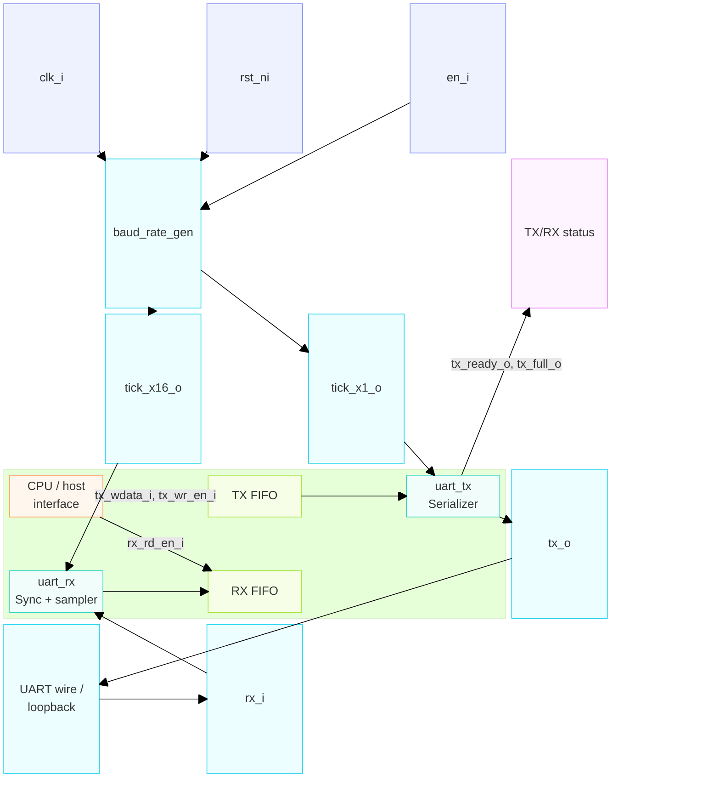

# SV-UART-Controller

A configurable UART controller in SystemVerilog: baud-rate generator, TX and
RX FSMs, and a register-style top-level integration suitable for driving
from a CPU/APB/AXI-lite adapter.

## Architecture



## RTL

| File | Description |
| --- | --- |
| `rtl/baud_rate_gen.sv` | Clock divider producing 16x-oversample and 1x baud tick strobes |
| `rtl/uart_tx.sv` | Transmit FSM: parallel-to-serial, start/data/parity/stop framing |
| `rtl/uart_rx.sv` | Receive FSM: oversampling synchronizer + serial-to-parallel deframing |
| `rtl/fifo.sv` | Generic synchronous FIFO (circular buffer + fill-level counter) |
| `rtl/uart_top.sv` | Integrates the above behind TX/RX FIFOs and a CPU-friendly register interface |

Parameters (set on `uart_top`, propagated down): `CLK_FREQ_HZ`, `BAUD_RATE`,
`DATA_BITS`, `PARITY_EN`, `PARITY_ODD`, `STOP_BITS`, `OVERSAMPLE`,
`TX_FIFO_DEPTH`, `RX_FIFO_DEPTH` (each FIFO defaults to 16 entries).

TX: write `tx_wdata_i` with `tx_wr_en_i` pulsed whenever `tx_ready_o` (TX
FIFO not full) is high; queued bytes drain into the line automatically.
RX: `rx_rdata_o` + `rx_valid_o` (RX FIFO not empty) behave like an RXDATA
register + status bit; each `rx_rd_en_i` pulse pops the oldest queued byte,
along with its own `rx_framing_err_o`/`rx_parity_err_o`. `rx_overrun_o` is
sticky and flags a byte that arrived while the RX FIFO was completely full
(and was therefore dropped).

## Testbenches

Self-checking SystemVerilog testbenches live in `tb/`, one per RTL module
plus a full-stack loopback integration test:

| Testbench | Covers |
| --- | --- |
| `tb/tb_fifo.sv` | Fill/drain/overflow/underflow, simultaneous push+pop, randomized stress vs. a queue model |
| `tb/tb_baud_rate_gen.sv` | tick_x16/tick_x1 period and phase relationship, `en_i` gating |
| `tb/tb_uart_tx.sv` | Serial framing across parity/stop-bit configurations, back-to-back sends |
| `tb/tb_uart_rx.sv` | Deframing, framing/parity error injection, start-bit glitch rejection |
| `tb/tb_uart_top.sv` | Self-loopback round trips, streaming, TX FIFO fill, RX FIFO fill + overrun |

Each testbench prints `PASS`/`FAIL` and exits non-zero on failure (via
`$fatal`), so they're CI-friendly as-is.

### Running

Requires [Icarus Verilog](http://iverilog.icarus.com/) (`iverilog` + `vvp`
on `PATH`).

```sh
cd tb
make            # run every testbench
make tb_uart_rx # run just one
make clean      # remove build/ output
```

## cocotb

A second, independent testbench for `uart_top` lives in `cocotb/`, written in
Python against [cocotb](https://www.cocotb.org/) instead of SystemVerilog.
It drives `uart_top` through a thin loopback wrapper
(`cocotb/uart_top_loopback.sv`) and covers the same scenarios as
`tb/tb_uart_top.sv`: reset state, single-byte round trips, back-to-back
streaming with a scoreboard, TX FIFO fill, and RX FIFO fill + overrun.

### Running

Requires Icarus Verilog (as above) plus Python 3.9+.

```sh
cd cocotb
python3 -m venv .venv && source .venv/bin/activate  # optional but recommended
pip install -r requirements.txt
make
```

## Synthesis check

`synth/synth_check.ys` runs the design through Yosys's generic `synth` flow
(no target cell library) as a sanity check -- proves it's synthesizable at
all, with no inferred latches and no dangling-wire/multiple-driver/
combinational-loop problems (`check -assert`). It's not a target-specific
(FPGA/ASIC) flow, and it's a supplement to simulation, not a replacement --
this only proves the design synthesizes cleanly, not that it behaves
correctly.

### Running

Requires [Yosys](https://yosyshq.net/yosys/).

```sh
cd synth
make
```
